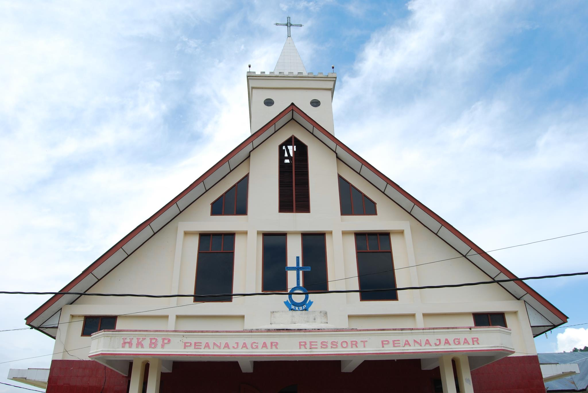

# Proyek Akhir 1 - Manajemen Data Jemaat HKBP Peanajagar

**Deskripsi Proyek**

Proyek ini adalah aplikasi web berbasis Laravel yang digunakan untuk mengelola data jemaat HKBP Peanajagar. Aplikasi ini memiliki dua mode, yaitu mode Admin dan mode User. Mode Admin digunakan untuk mengelola data jemaat, sedangkan mode User digunakan untuk melihat data jemaat berdasarkan lingkungan, kepala keluarga, dan anggota keluarga.

**Fitur Utama**

| Mode Admin | Mode User |
|------------|------------|
| - CRUD Data Jemaat | - Melihat data jemaat per lingkungan |
| - CRUD Pengumuman | - Melihat data kepala keluarga per lingkungan |
| - CRUD Jadwal Ibadah | - Melihat data anggota keluarga per kepala keluarga |
| - CRUD Informasi Keuangan | - Melihat pengumuman, jadwal ibadah, informasi keuangan, data donasi, dan galeri |
| - CRUD Data Donasi | |
| - CRUD Galeri | |

<!--  -->

**Panduan Memulai**

1. **Clone repositori**:
    ```sh
    git clone https://github.com/felixnatanaelbutarbutar/PA-1_08.git
    ```
2. **Pindah ke direktori proyek**:
    ```sh
    cd PROYEK-BESAR-KELOMPOK-08
    ```
3. **Generate kunci aplikasi Laravel**:
    ```sh
    php artisan key:generate
    ```
4. **Jalankan migrations**:
    ```sh
    php artisan migrate
    ```
5. **Jalankan server development**:
    ```sh
    php artisan serve
    ```
6. **Akses proyek di browser**:
   [http://localhost:8000](http://localhost:8000)

**Kontak**

- **Email**: [felixnatb@gmail.com](mailto:felixnatb@gmail.com)
